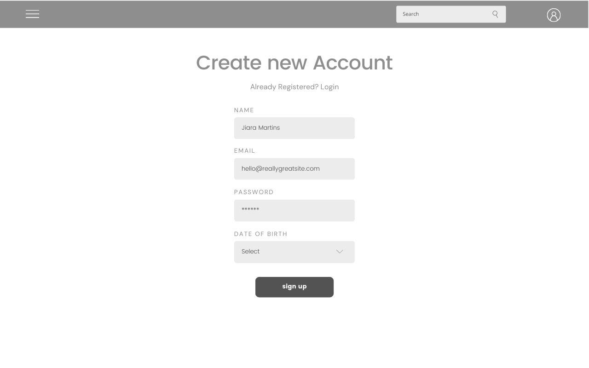
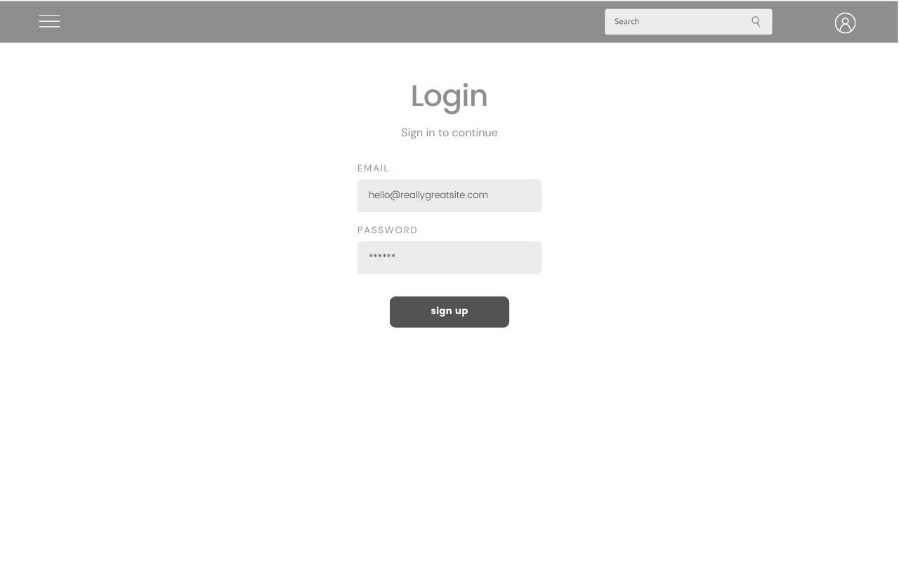
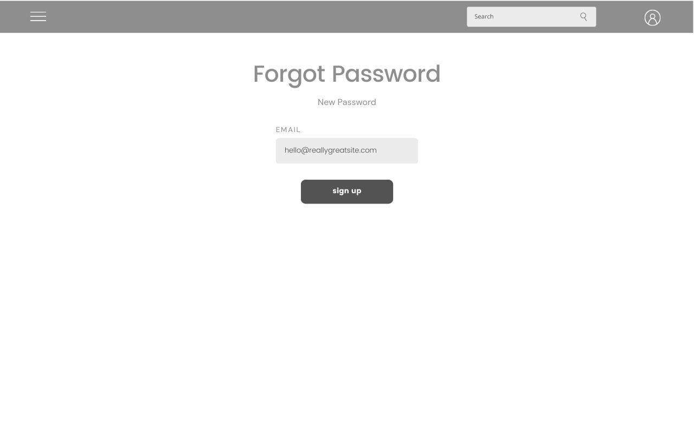
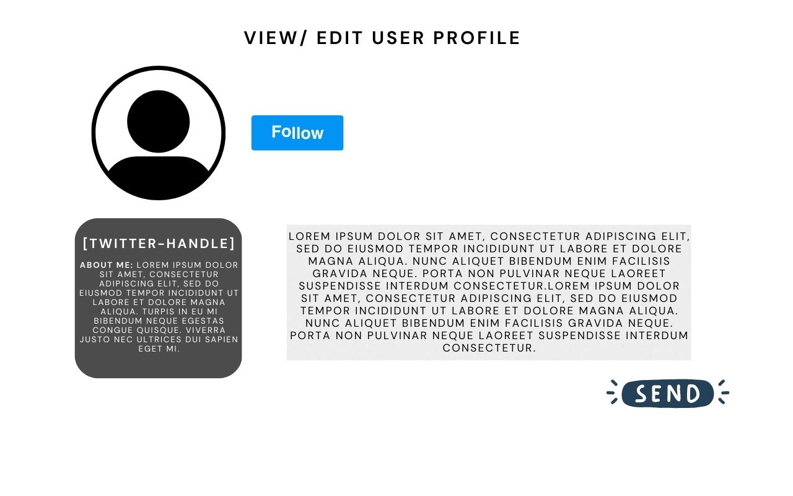
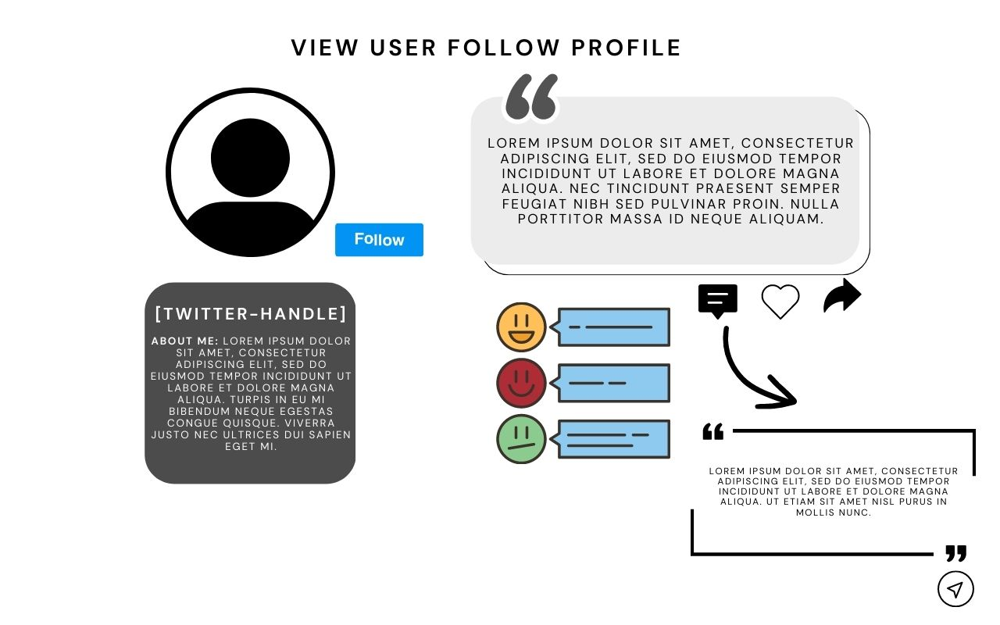

# Twitter Clone Frontend

Twitter clone built with React.

Demo - "...."

Backend Respository - "https://github.com/jennielaii/twitter-clone-backend.git"

## WireFrame

## Features

1. Signup/Login
2. Add Tweet
3. Follow People
4. Like, Retweet, comment
5. View Profile

## Upcoming Features

1. Search users in explore sections
2. Notfications
3. Live updates of likes and retweets

## MVP

- 2/23: Research Twitter app and generate/update features list. Begin framework of the frontend and if have time would try to work on the basic framework on the backend.
